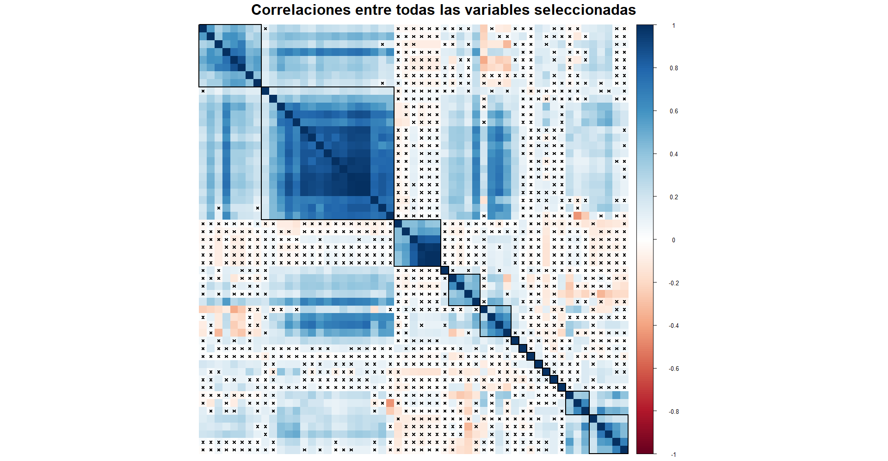
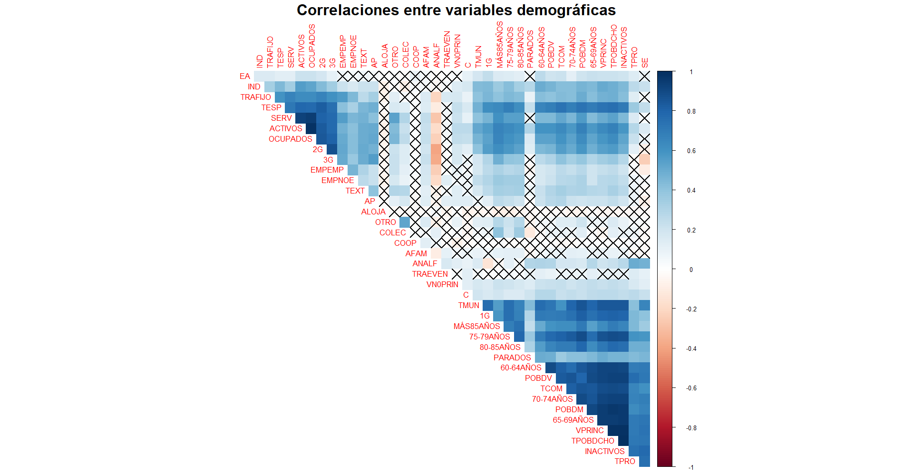
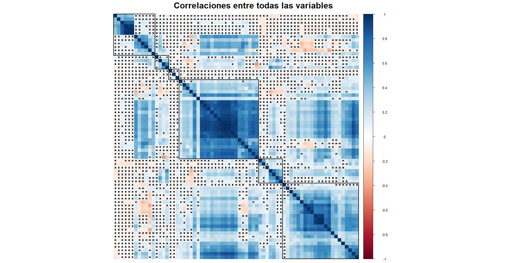

```{r setup, include=FALSE}
knitr::opts_chunk$set(echo = FALSE, warnings = FALSE, message = FALSE, fig.pos = "H")
setwd("C:/Users/ferran/Documents/Universitat/US/GEO/trabajos/ancianos_")
```

```{r}
library(knitr)
library(corrplot)
library(dplyr)
library(readxl)
library(psych)
library(mapsf)
library(rgeoda)
```

```{r}
source("scripts/import.R")
source("scripts/tabs.R")
```

\newpage
# Introducción

## Contexto

El envejecimiento demográfico emerge como un fenómeno geográfico crítico que podría acarrear serias implicaciones macroeconómicas estructurales en nuestra sociedad. En consecuencia, resulta imperativo abordar de manera inmediata políticas orientadas a mejorar la calidad de vida de la población mayor, fundamentadas en estudios que delineen su situación espacial y social, particularmente en aquellos entornos urbanos donde su presencia es más significativa.

## Objetivos

En el actual escenario, nos enfrentamos al desafío de localizar áreas urbanas en el municipio de Sevilla que compartan una estructura demográfica similar, especialmente en lo que respecta a la población mayor. Para abordar este objetivo, emplearemos distintos métodos de análisis estadístico multivariante y espacial. La meta es desarrollar servicios sociales y de asistencia que tomen en cuenta las características específicas de los ancianos y su distribución geográfica en la ciudad. En este contexto, nuestro enfoque consiste en identificar segmentos homogéneos de la población anciana en áreas urbanas. La ejecución de este proceso nos permitirá diseñar servicios sociales y de asistencia que se adapten a las necesidades particulares de los ancianos, considerando tanto su tipología como su ubicación en la ciudad.

## Estructura

Proponemos una agrupación de las secciones electorales a través de un análisis clúster y organizamos el contenido de la siguiente manera: Primero comentamos la metodología que hemos empleado, tanto las técnicas como el software. Luego, dada la gran cantidad de variables con las que contamos nos servimos del análisis factorial para reducir la dimensionalidad del conjunto de datos. Seguidamente clasificamos las secciones a partir de los factores resultantes del proceso anterior. Planteamos varios métodos distintos, tanto los clásicos análisis jerárquicos y de k-medias como el enfoque con restricciones espaciales. Finalmente resumimos y contextualizamos los resultados obtenidos.

\newpage
# Metodología

## Técnicas

Puesto que nuestro objetivo es agrupar zonas homogéneas en cuanto a la población anciana con vistas a la implantación de servicios asistenciales proponemos un análisis clúster de las secciones censales basado en los datos disponibles. Para ello precisamos resumirlos para realzar la calidad del análisis clúster final. De manera que este trabajo consta de dos partes bien diferenciadas que se complementan entre ellas: La reducción dimensional a través del análisis factorial y la agrupación de las secciones en clústers. 

La naturaleza de nuestro trabajo es eminentemente práctica y por tanto no entramos a fondo en los detalles de los modelos matemáticos ni sus implantaciones algorítmicas. A cambio nos centramos en la aplicación de éstos esbozando los conceptos intuitivamente y remarcando las ideas más importantes para la relalización de éstos. En el siguiente párrafo detallamos los pasos e ideas principales del análisis factorial y en el próximo introducimos los distintos enfoques que hemos empleado en el análisis clúster.

El análisis factorial pretende identificar una estructura de variabilidad conjunta. Parte de una gran cantidad de variables e idealmente lleva a un número más bajo de factores. Para ello requiere que las variables estén relacionadas entre sí, de esta manera puede resumir la información usando menos factores. Estos factores son *variables latentes* que, de alguna manera recogen la variabilidad conjunta de los datos. Un método particular del análisis factorial es la descomposición en [componentes principales.](https://es.wikipedia.org/wiki/An%C3%A1lisis_de_componentes_principales) Los pasos a seguir para realizar un análisis factorial son:

1. **Selección de variables:** En este apartado escogemos las variables que nos interesen. Ya sea por la representatividad del fenómento que nos atañe o por cuestiones técnicas. Preferiremos usar variables que estén relacionadas entre sí para extraer la estructura de variabilidad conjunta. Sin embargo no debemos incluir variables que sean combinaciones lineales de otras variables ya que así no podremos invertir la matriz de correlaciones y éste es un cálculo necesario para el resto dle proceso.

2. **Adecuación de la muestra:** Una vez tegamos las variables seleccionadas es preciso cercionarse de que la selección es apropiada para el análisi factorial. Para ello realizamos varias pruebas estadísticas que hacen alusión a los criterios con los que incluimos las variables. Dos de los más usados son la prueba de adecuación *KMO*, que comprueba que la interrelación de las variables abarque gran parte de la muestra y la prueba de *esfericidad de Barlett*, que verifica que exista correlación entre las variables asintóticamente.

3. **Extracción de factores:** Con las variables listas, resumimos los datos usando variables latentes. Entonces debemos decidir el número de factores, extraerlos y rotarlos para que se puedan interpretar con facilidad. Finalmente se asignan las puntuaciones factoriales a cada observación.

  i. **Número de factores:** Contra mayor sea más representativa será la proyección de los datos a costa de un reducido poder de síntesi. Se suelen usar varios criterios para determinar el número adecuado de factores: La regla de Kaiser propone extraertantos factores como *eigenvalues* positivos existan en la descomposición. Intuitivamente nos quedaríamos con tantos factores como combinaciones lineales incrementan su importancia en la proyección (explicación algo más detallada en el apartado correspondiente). Otro criterio es el de la varianza explicada, consiste en extraer tantos factores como sean necesarios para representar con cierta precisión la varianza de los datos. La proporción varía en función del ámbito de estudio y del investigador, una proporción indicativa es el 70%. El último método que empleamos para decidir cuantos factores empleamos es el *scree plot*, que representa gráficamente el *eigenvalue* y el número de factores. Se basa en el ritmo de decrecimiento de la importancia de cada factor. Es decir, si notamos que el *eigenvalue* decae muy significativamente a partir de cierto número de factores optaremos por extraer uno menos. Cabe decir que todos estos criterios son complementarios y no existe una regla precisa para determinar la cantidad de factores a usar.
  
  ii. **Extracción y rotación:** Este paso concierne cuestiones más técnicas que quedan fuera del ámbito de este trabajo. Lo relevante es que cuando sabemos cuántos factores vamos a extraer y los ajustamos normalmente nos interesa rotarlos. Es decir, buscar una representación equivalente a la proyección que hemos encontrado manteniendo la representabilidad de los datos. Hacemos esto para facilitar la interpretación e intuir los motivos latentes por los que algunas variables están relacionadas. Esencialmente se distinguen dos tipos de rotación que se alcanzan aplicando uno u otro algoritmo: La rotación es ortogonal si persigue un conjunto de factores no correlacionado entre sí. Si existen razones para pensar que los factores están relacionados entre sí se usa la rotación oblícua.
  
  iii. **Puntuaciones factoriales:** Cuando estamos satisfechos con la proyección de los datos reexpresamos las variables para cada observación (en nuestro caso para cada sección censal) usando los factores resultantes. Así podremos ver qué factores son más importantes y en qué sentido para cada una de las unidades de estudio.
  
Así logramos reducir la dimensionalidad del conjunto de datos y estamos listos para llevar a cabo el análisis clúster. Para éste planteamos dos métodos clásicos y uno específico restringiendo las agrupaciones geográficamente por contiguidad. La distinción principal está en la forma de agrupación de entidades: Jerárquica o no jerárquica. presentamos el ejemplo canónico de cada una.

1. **Agrupación jerárquica:** Se basa en las distancias entre unidades de estudio. Esta distancia se puede definir de multitud de maneras según el ámbito y o interés del investigador. Por ejemplo la distancia euclídea se considera la distancia geométrica canónica en un espacio multidimensional. Otro ejemplo es la distancia de Mahalanobis, que tiende a disminuir las distancias entre entidades dentro de los clústers y reducir las disancias entre clústers. Con la distancia definida hay que decidir en qué dirección se crean los grupos: O bien se parte de una situación completamente desagregada y se van adhiriendo las entidades al clúster más cercano o se empieza con un único grupo que contiene todos los puntos para ir desagregando al más lejano. Es habitual esar esta última, así lo hacemos. Una ventaja de la agrupación jerárquica es que no precisa del número de grupos para llevar a cabo la agrupación. El número de grupos se decide a posteriori usando el dendograma, un gráfico que representa las agrupaciones o disoluciones con la distancia a la que suceden.

2. **Agrupación no jerárquica, k-medias:** En este caso no es necesario definir una noción de distancia, sin embargo hay que especificar el número de clústers de antemano. El centro de cada clúster es el centroide, cuya ubicación se determina de manera que la distancia entre los centroides y los puntos del grupo sea mínima. El algoritmo de k-medias actualiza iterativamente la posición de los centroides y la pertenencia de las entidades hasta minimizar la suma de cuadrados dentro de cada grupo. El resultado final depende del número de clústers y de la posición inicial de los centroides. Los centroides iniciales se eligen de manera que la convergencia esté garantizada. El número de grupos se suele elegir con la ayuda del *elbow plot*, que representa la velocidad de disminución del error en función del número de clústers. En cualquier caso se suelen ajustar varios análisis con diferente número de clústers para compararlos y elegir el más favorable.

3. **Agrupación con restricciones espaciales, SKATER:** Existen múltiples métodos de agrupación que cuentan con restricciones espaciales. En este caso también se hace la distinción clásica entr métodos jerárquicos o no jerárquicos. Dentro de los métodos jerárquicos el análogo algomerativo es SCHC (*Spatially Constrained Hierarchical Clustering*) y el disolutivo es SKATER (*Spatial C(K)luster Analysis by Tree Edge Removal*). Este último es el que empleamos en el proyecto. Algunos de los métodos no jerárquicos son el AZP (*automatic zoning procedure*) y el Max-p (considera la agrupación como un problema de programación lineal entera a optimizar). En cualquier caso se requiere una definición de contigüidad para la restricción y o bien el número de grupos se especifica de antemano o se usa una tolerancia de error. Para más información se puede consultar [este enlace](https://geodacenter.github.io/workbook/9d_spatial3/lab9d.html) o [este enlace.](https://geodacenter.github.io/workbook/9c_spatial4/lab9c.html)


## Herramientas

Manejamos los datos que hemos introducido en la sección anterior usando las herramientas que describimos brevemente a continuación, basadas en el software libre [R](https://www.r-project.org/).

Trabajamos usando R con intención de aprender a usar la herramienta para el tratamiento de datos y cuestiones relacionadas con la geografía. Para ello empleamos algunos paquetes muy conocidos como [dplyr](https://dplyr.tidyverse.org/) o [tidyr](https://tidyr.tidyverse.org/) para el manejo de datos generales, [sf](https://r-spatial.github.io/sf/) para el procesamiento de datos de SIG y [mapsf](https://riatelab.github.io/mapsf/) o [ggplot2](https://ggplot2.tidyverse.org/) para la representación gráfica de éstos, también usamos [bookdown](https://bookdown.org/) para la redacción del trabajo. También empleamos [corrplot](https://cran.r-project.org/web/packages/corrplot/vignettes/corrplot-intro.html) para representar correlaciones. Para el análisis factorial hemos usado [psych](https://cran.r-project.org/web/packages/psychTools/vignettes/overview.pdf) y para el análisis clúster con restricciones espaciales [rgeoda.](https://geodacenter.github.io/rgeoda/)

Por otra parte hemos usado control de versiones [GIT](https://git-scm.com/) en el repositorio de [Github](https://github.com/) que se encuentra en [este enlace](https://github.com/pompolompo/comarcas). Ahí se almacena todo lo que ha sido necesario a lo largo del trabajo, así como un historial de verisones. Se pueden encontrar carpetas con los gráficos, otras con funciones de utilidad (por ejemplo para pasar de identificador comarcal a nombre) y otras con scripts que contienen el procesamiento de los datos de flujos, creación de tablas y gráficos.


\newpage
# Reducción dimensional

Disponemos de muchas variables, eso motiva las técnicas de reducción dimensional. Usaremos análisis factorial de componentes pricipales, la idea es sintetizar todas las medidas disponibles en variables latentes. Lo haremos aprovechando la correlación que comparten. Para ello seleccionamos las variables que incluiremos a partir de un breve análisis exploratorio. Luego comprobaremos si es pertinente usar los procedimientos en cuestión en el conjunto de datos resultante. Entonces realizaremos varios ajustes con diferente número de factores hasta alcanzar la descomposición más satisfactoria en términos de representabilidad de las variables iniciales. Finalmente aplicaremos técnicas de rotación con tal de lograr factores ortogonales que sean interpretables. Con éstos extraeremos las puntuaciones factoriales que más adelante usaremos para crear clústers.

## Selección de variables y adecuación de los datos

La selección de variables sirve para subsanar potenciales problemas y afinar en el cálculo de factores. Es importante tanto para que se pueda realizar el análisis factorial como para que éste sea eficiente y se ajuste un modelo robusto con interpretación relativamente simple evitando sobreajuste.

Por ejemplo, si nos fijamos en las variables demográficas veremos que se incluyen múltiples medidas de población quedando algunas determinadas completamente por el resto. En cuanto a la *situación laboral* tenemos población activa, ocupada, inactiva y parados.Entonces el total queda determinado por otra variable, ya sea la población total o u subgrupo de ésta y por tanto son linealmente dependientes. Por tanto la matriz de correlaciones no será inverible y en consecuencia no se podrá realizar el análisis factorial. Lo mismo ocurre con algunas variables del estado de las viviendas. En el annexo se muestra una lista completa de las variables que han sido excluidas por este motivo.

Por otro lado es importante que las variables seleccionadas estén correlacionadas entre sí. Para comprobarlo representamos gráficamente la correlación entre las variables seleccionadas y recogemos en una tabla estadísticos relevantes para la selección de variables como: 

  - Estimación inicial de comunalidades^[Correlación múltiple al cuadrado]
  - Suma de correlaciones absolutas
  - Número de variables no correlacionadas^[Test de correlación de Pearson, nivel de significación del 5%]

Las variables que se muestran en la tabla quedan excluidas del análisis factorial.

```{r}
#| fig.cap = "Se muestran las variables con una comunalidad estimada menor al 70%,
#|  menos de 30 correlaciones no significativas al 5% y una suma de correlaciones absolutas menor a su mediana."
cor_tab0
```

```{r, out.width="100%", fig.align='center'}
#| fig.cap = "Correlaciones entre todas las variables."

```

Veamos ahora si el conjunto de datos seleccionados resulta apropiado para el análisis factorial o si debemos seleccionar variables con un criterio más estricto. Para ello realizamos varios tests:

**Esfericidad de Barlett:**

- Hipóteis nula: La matriz de correlaciones es la identidad (no existe ninguna correlación)
- Bajo $H_0$ el estadístico de contraste sigue una $\chi^2$, asintóticamente
- Disponemos de más de 400 observaciones, se sostiene la suposición asintótica

```{r, echo = TRUE}
cortest.bartlett(R1, n = nrow(X1))[["p.value"]] # podemos rechazar H_0
```

**Kaiser, Meyer, Olkin:**

- Medida de adecuación de la muestra para un análisis factorial (basa)
- Compara la proporción de correlación y la [correlación parcial](https://en.wikipedia.org/wiki/Kaiser%E2%80%93Meyer%E2%80%93Olkin_test#Measure_of_sampling_adequacy)]
- Está acotada entre 0 y 1, según Kaiser:
    + Valores mayores a 0,9 son maravillosos
    + Valores mayores a 0,8 son meritorios
    + Valores mayores a 0,7 son medios
    + Valores mayores a 0,6 son mediocres
    + Valores mayores a 0,5 son miserables

```{r, echo = TRUE}
KMO(R1)[[1]] # según Kaiser, la adecuación de la muestra es meritoria
```

\newpage
## Número, rotación y puntuaciones factoriales

Ahora nuestra intención es identificar una estructura latente dentro del conjunto de datos. Se focaliza el interés en los factores capaces de explicar una proporción significativa de la variabilidad presente en los datos. Para determinar cuántos factores debemos retener, empleamos dos criterios. En primer lugar, se puede dibujar un scree plot para evaluar los *eigenvalues* de los factores estimados. Además, aplicamos la Regla de Kaiser, que sugiere retener aquellos factores cuyos *eigenvalues* superen la unidad. Otra estrategia consiste en seleccionar tantos factores como sean necesarios para explicar alrededor de un 70% de la variabilidad de los datos.

**Regla de Kaiser:**

En el ámbito del álgebra una matriz (como la de correlaciones) se puede interpretar como una transformación lineal. Los *eigenvectors* asociados a una transformación son aquellos vectores cuya dirección es invariable a la misma y los *eigenvalues* aparejados son la medida en la que la dirección se alarga o mengua en magnitud. Bajo ciertas condiciones de regularidad estos vectores forman una base sobre la que se puede descomponer la transformación en cuestión. La idea de Kaiser es tomar tantos factores como autovectores de "alarguen" (su importancia crezca) en el proceso de descomposición.^[Para más información sobre los *eigenvectors* y *eigenvalues* consultar [este enlace](https://en.wikipedia.org/wiki/Eigenvalues_and_eigenvectors)]

```{r, echo = TRUE}
autov_1 = eigen(R1)[["values"]]; sort(autov_1, decreasing = T) %>% round(digits = 2)
sum(autov_1 > 1) # según el criterio de Kaiser, usaremos 8 factores
```
En este caso Kaiser recomienda tomar 8 factores. No obstante los últimos están muy cerca de 1, es algo que debemos tener en cuenta para la selección del número de factores.

**Proporción de la varianza explicada:**

Para emplear el método de la varianza explicada por factores necesitamos realizar un análisis factorial como tal. De manera que ajustamos un modelo co un número arbitrario de factores y comprobamos cuántos son necesarios 

```{r, echo = TRUE}
fit_1 = factanal(na.omit(X1[,-1]), factors = 8, lower = .01)
print(fit_1[["loadings"]], digits = 2, cutoff = .5, sort = TRUE)
```

Esta salida muestra por un lado las cargas factoriales de cada variable inicial y por el otro la proporción de varianza explicada por cada uno de los factores. Nos interesa la parte final. Nos fijamos en que se explica alrededor del 70% de la varianza con 7 u 8 factores. También notamos que los primeros factores recogen sustancialmente más varianza que el resto.

**Scree plot:**

En este caso interpretamos gráficamente los *eigenvalues* asociados a factores con el número que usamos. Notamos que los cuatro primeros son relativamente más altos a los dos siguientes, que resultan ser los últimos que superan el umbral de 1. En este caso el gráfico sugiere usar alrededor de 6 factores.

```{r}
sim_1 = fa.parallel(R1, n.obs = 441, fm = "ml", fa = 'fa')
```

**Interpretación en conjunto:**

Los diversos métodos indican una cantidad de factores similar: Entre 6 y 8. Puesto que utilizar 7 factores concuerda con los resultados de los diferentes criterios y está enmedio de las sugerencias de cada uno usaremos 7 factores para reducir la dimensionalidad de los datos.

```{r, echo = TRUE}
fit_2 = factanal(na.omit(X1[,-1]), factors = 7, lower = .007, scores = "regression")
print(fit_2[["loadings"]], digits = 2, cutoff = .5, sort = TRUE)
```

Representamos los pesos factoriales más importantes (almenos 0,5) para cada variable. Una versión más detallada a la que nos referimos en las siguientes líneas se puede encontrar en ele annexo. Como era de esperar los primeros factores cargan más información que los siguientes y por tanto su interpretación es más compleja. A continuación proponemos una breve e intuitiva interpretación intuitiva sobre cada uno:

**Factor 1: Necesidad futura** 
Contiene información sobre variables demográficas y del hogar. Por un lado indica una población sustancial que en general es de procedencia cercana^[de Sevilla o Andalucía.] y de edad no muy avanzada.^[se relaciona más con los tramos de edad más bajos.] Teniendo en cuenta las variables laborales y educativas está relacionado con una estrato social medio-bajo. En resumen, describe zonas en las que servicios sociales y asistenciales serán necesarios en un futuro cercano.

**Factor 2: Ahora autosuficiente**
En cierta manera es la antítesis del anterior factor. Lo único que comparten es la relación con la cantidad de habitantes. Este factor describe zonas relativamente pobladas por personas con procedencia lejana^[Fuera de Andalucía y en mayor medida de fuera del España.] con capacidad económica presumiblemente alta^[Relacionado con nivel educativo alto y trabajo fijo.] y viviendas con caché.^[Viviendas grandes en términos de espacio y habitaciones.] Cabe destacar que en cierta manera la relación con los tramos de edad describe una población más envejecida, sin embargo la conexión es menor que en el caso anterior.

El resto de factores representan mucho menos la situación que los dos primeros y su nombre explica en sí mismo la interpretación asociada a cada una. A continuación comentamos la descriptiva de las puntuaciones factoriales y en la siguiente sección agruparemos las secciones censales en clústers.

**Factor 3: Faltan suministros básicos**

**Factor 4: Clase media-baja**

**Factor 5: Baja densidad de población**

**Factor 6: Clase media-alta**

**Factor 7: Vivienda colectiva**

```{r}
aux = describe(fit_2$scores)[,-c(1,2, 3, 4, 6, 13)] %>% round(digits = 2)
nb_fact = c(
  "Necesidad futura",
  "Ahora autosuficiente",
  "Faltan suministros básicos",
  "Clase media-baja",
  "Baja densidad de población",
  "Clase media-alta",
  "Vivienda colectiva"
)
rownames(aux) = paste0(1:7, ". ", nb_fact)

kable(aux, booktabs = TRUE, format = "latex", align = "c",
      caption = "Estadísticos descriptivos de las puntuaciones factoriales",
        row.names = TRUE) %>%
  kable_styling(latex_options = c("striped", "hold_position"),
                full_width = FALSE)
```

Como es habitual las variables han sido estandarizadas antes del análisis, de modo que pasamos por alto la media y varianza. Nos fijamos en el signo de la mediana y la asímetría (skew): Todas las variables consendan una cola derecha pesada, en otras palabras para cada factor existen pocas secciones con puntuaciones muy altas mientras que muchas ligeramente bajas. El caso extremo es el factor de *Vivienda colectiva*, es plausible que las viviendas colectivas se encuentren muy concentradas en secciones particulares.

Destacamos que la mediana más baja es por orden la de los factores *Baja densidad de población*, *Clase media-baja* y *Ahora autosuficiente* intuimos que seguramente habrá algunas secciones con muy densidad muy baja de población, muchas personas de clase medio-baja y muchas personas con poder adquisitivo alto. Recogemos los histogramas correspondientes a todos los factores en el annexo.

\newpage
# Clústers

Los métodos de clasificación están a la orden del día y existe gran variedad de métodos o enfoques. En el presente trabajo nos focalizamos en los que son de aplicación al contexto geográfico. Sin embargo es importante consolidar cierta base a través de los métodos clásicos. De manera que el el apartado de agrupación en clústers presentamos dos métodos clásicos y un tercero que tiene en cuenta restricciones geográficas.

## Método jerárquico

La idea es asociar o separar secciones de sus respectivos grupos iterativamente. Calculamos una medida de distancia entre los objetos de estudio a partir de las variables deseadas. Se puede partir de un grupo que contenga todos los agentes e ir separando aquellos más diferentes y colocándolos en el clúster más adecuado o bien es posible empezar con una estructura desagregada e ir conectando los agentes más cercanos entre sí. También es necesario definir la distancia de un individuo a un grupo: Las formas más comunes son el vecino más cercano^[La distania mínima entre el agente y  cualquier componente del grupo], el vecino más lejano^[La distania máxima entre el agente y  cualquier componente del grupo] o la media.^[Distancia media entre el agente en cuestión y cada componente del grupo] Empleamos el mecanismo de agregación y la distancia al vecino más lejano. Una parte crucial del análisis es decidir *"por dónde cortamos"* o cuántos grupos queremos. En esta tarea nos servimos del dendograma, de las características de los grupos resultantes (número de clústers, integrantes por clúster, medidas de distancia entre grupos y dentro de cada grupo).

Partimos de las puntuaciones factoriales (o cualquier otra variable de clasificación) asociadas a cada sección censal:

```{r, echo = TRUE}
punt = fit_2$scores
# asignamos a los nombres de fila el código de sección censal
i = which(is.na(X1), arr.ind = T)[,"row"] %>% unique() # secciones con na (omitidas)
rownames(punt) = X1$SECCEN[-i]
```

Los métodos jerárquicos se basan en la noción de distancia. Existen muchas formas de definir la distancia entre dos secciones y el tema plantea un debate extenso. Sin embargo este no es el objeto de nuestro trabajo, de modo que usamos la distancia euclídea, algo que se puede considerar estándar. Se define como la suma de los cuadrados de las diferencias sobre todas las variables:

$$
\text{dist}(X, Y) = \sqrt{\sum^{n}_{i = 1}{(x_i - y_i)^2}}
$$

Es importante identificar y excluir outliers del análisis porqué pueden provocar resultados que no representan la estructura correctamente. Representamos la distribución de distancias y medias de distancias y decidimos excluir observaciones atípicas:

```{r, echo = TRUE}
# calculamos las distancias dos a dos
dis0 = dist(punt, method = "euclidean", p = 2)

# transformamos en matriz y calculamos la distancia media para cada sección
mdis0 = as.matrix(dis0) 
m = apply(mdis0, 1, mean)

# dibujamos un histograma de distancias y otro de las medias de distancia
par(mfrow = c(1, 2))

## distancias
d0 = density(dis0)
d0$y = d0$y*d0$n

plot(d0, main = "Distancias", xlab = NULL, ylab = NULL)
hist(dis0, add = T, ylab = NULL)
lines(d0, lwd = 3, ylab = NULL)

## medias de distancia
d0 = density(m)
d0$y = d0$y*d0$n

plot(d0, main = "Medias de las distancias", xlab = NULL, ylab = NULL)
hist(m, add = T, ylab = NULL)
lines(d0, lwd = 3, ylab = NULL)

# extraemos las secciones con media muy alta y transformamos en distancia
nb = m[which(m > 8)] %>% names() 
dis1 = mdis0[-which(rownames(mdis0) %in% nb),
             -which(colnames(mdis0) %in% nb)] %>% as.dist()
```

Seguidamente clasificamos las secciones en clústers usando el método de agregación y la distancia al vecino más lejano:

```{r, echo=TRUE}
clust_j = hclust(dis1, method = "complete")
```

Ahora que ya tenemos las secciones clasificadas decidimos la cantidad de clústers que nos convienen.

```{r}
#| fig.cap = "Parece que un punto de corte adecuado está alrededor de 5 y 6."
plot(clust_j, labels = FALSE)
```

Veamos ahora qué grupos se han formado si usamos 8 clústers. Por un lado presentamos una tabla describiendo las características factoriales de cada clúster y por otro presentamos un mapa que representa la ubicación los clústers.

```{r}
# grupo al que pertenece cada sección censal
grupo_j = cutree(clust_j, h = sort(clust_j$height, decreasing = T)[8])
grupos_j = lapply(1:max(unique(grupo_j)), 
                  function(x){row.names(punt)[grupo_j == x]}) # agrupaciones

# medidas cada clúster
medias_j = sapply(1:max(unique(grupo_j)), function(x){apply(punt[grupo_j == x,], 2, mean)})
```

```{r}
#| fig.cap = "Media de las puntuaciones factoriales y 
#| número de secciones en cada clúster."
aux = t(medias_j) %>% round(digits = 2) %>%
  data.frame() %>% mutate(n = sapply(grupos_j, length)) %>%
  select(n, everything())

# table names
rownames(aux) = paste("Clúster", 1:8)

# table
kable(aux, booktabs = TRUE, format = "latex", align = "c",
      caption = "Medias de factores para cada clúster",
      row.names = TRUE) %>%
  kable_styling(latex_options = c("striped", "hold_position"),
                full_width = FALSE)
```

```{r}
# añadimos el clúster al shapefile
aux_j = shp[which(shp$sec %in% names(grupo_j)),] %>%
  arrange(sec) %>%
  mutate(
    'Clúster' = grupo_j[which(names(grupo_j) %in% shp$sec)]
  )

# graficamos
mf_map(aux_j, var = "Clúster", type = "typo", leg_frame = TRUE)
mf_layout(title = "Clústers jerárquicos",
          credits = paste0(
            "Fuente: Universidad de Sevilla\n",
            "mapsf ",
            packageVersion("mapsf")))
```
**breve comentario sobre los clústers**

mapa: problema, no colindantes (sin restricción geográfica)
medias factoriales: *falta indagar*

## Método de k-medias

El método de k-medias se basa en organizar los datos de entrada en grupos, donde cada grupo tiene un centro representativo llamado centroide. La ubicación de estos centroides se determina de manera que la distancia entre ellos y los puntos del grupo sea la menor posible. 

Dada la ubicación de los centroides, se calcula la distancia que los separa de cada sección y éstas se asignan al clúster más cercano. Luego se actualiza la posición de los centroides en base a los puntos que pertenecen a cada clúster. El objetovo es minimizar la suma de cuadrados dentro de cada grupo (error) y se itera hasta que no dismiuya más. 

El resultado final depende del número de clústers y de la posición inicial de los centroides. Para este segundo aspecto el algoritmo selecciona centroides iniciales tales que la convergencia esté garantizada. En cuanto al número de clústers, lo elegimos externamente (normalmente basándonos en el *Gráfico de Codo* o *Elbow Method*^[Muestra la velocidad de disminución del error en función del número de clústers.]).

En este caso trabajamos con las variables en lugar de distancias calculadas a partir de éstas. No obstante normalizamos su escala para que el efecto de todas sea el mismo el el error:

```{r, echo = TRUE}
punt_k = (apply(punt, 2, max) - apply(punt, 2, min)) %>% sweep(punt, 2, ., FUN = "/")
```

A continuación dibujamos el *Gráfico de Codo* para elegir el número de clústers que usaremos. En este caso no hay una respuesta clara porqué el ritmo de descenso es relativamente estable, pero parece que deberíamos usar entre 5 y 8 grupos. Al contrastarlo con el gráfico sin reescalar las variables decidimos usar 7 grupos.

```{r, fig.dim=c(5, 6)}
#| fig.cap = "Gráfico de codo con la misma escala 
#| de factores (izquierda) y sin reescalar (derecha)"

par(mfrow = c(2, 1))
wss = numeric(0)
for(i in 1:15){
  wss = sum(kmeans(punt_k, centers = i)[["withinss"]]) %>%
    c(wss, .)
}
plot(1:15, wss, type = "l", lwd = 2,
     xlab = "Número de clústers", ylab = "Error",
     main = "Gráfico de codo con factores reescalados")

wss = numeric(0)
for(i in 1:15){
  wss = sum(kmeans(punt, centers = i)[["withinss"]]) %>%
    c(wss, .)
}
plot(1:15, wss, type = "l", lwd = 2,
     xlab = "Número de clústers", ylab = "Error",
     main = "Gráfico de codo sin reescalar factores")
```

Entonces, realizamos el análisis con 7 clústers y representamos los resultados como antes en una tabla y un mapa:

```{r, echo = TRUE}
clust_nj = kmeans(punt_k, centers = 7)
```

```{r}
# grupo al que pertenece cada sección censal
grupo_nj = clust_nj$cluster
grupos_nj = lapply(1:max(unique(grupo_nj)), 
                  function(x){row.names(punt)[grupo_nj == x]}) # agrupaciones

# medidas cada clúster
medias_nj = sapply(1:max(unique(grupo_nj)), 
                   function(x){apply(punt[grupo_nj == x,], 2, mean)})
```

```{r}
#| fig.cap = "Media de las puntuaciones factoriales y 
#| número de secciones en cada clúster."
aux = t(medias_nj) %>% round(digits = 2) %>%
  data.frame() %>% mutate(n = sapply(grupos_nj, length)) %>%
  select(n, everything())

# table names
rownames(aux) = paste("Clúster", 1:7)

# table
kable(aux, booktabs = TRUE, format = "latex", align = "c",
      caption = "Medias de factores para cada clúster",
      row.names = TRUE) %>%
  kable_styling(latex_options = c("striped", "hold_position"),
                full_width = FALSE)
```

```{r}
# añadimos el clúster al shapefile
aux_nj = shp[which(shp$sec %in% names(grupo_nj)),] %>%
  arrange(sec) %>%
  mutate(
    'Clúster' = grupo_nj[which(names(grupo_nj) %in% shp$sec)]
  )

# graficamos
mf_map(aux_nj, var = "Clúster", type = "typo", leg_frame = TRUE)
mf_layout(title = "Clústers no jerárquicos",
          credits = paste0(
            "Fuente: Universidad de Sevilla\n",
            "mapsf ",
            packageVersion("mapsf")))
```

**breve comentario sobre los clústers**

mapa: problema, no colindantes (sin restricción geográfica)
medias factoriales: *falta indagar*

## Método con restricción geográfica

El clustering espacial pretende agrupar un gran número de áreas geográficas o puntos en un número menor de regiones basándose en similitudes en una o más variables. Es necesario cuando se requiere que los clusters sean espacialmente contiguos. Trabajamos con la librería `rgeoda`, basada en el software libre [GeoDa](https://geodacenter.github.io/), que cuenta con varios métodos. A continuación comentamos sus elementos en común y uno de ellos:

Para aplicarlos se requiere:

- Información geográfica sobre las unidades de estudio
- Medidas de las variables para las unidades de estudio
- Relación de contigüidad^[Definición de qué se considera vecino, más info en [este enlace](https://geodacenter.github.io/rgeoda/articles/rgeoda_tutorial.html#spatial-weights)] sobre las unidades de estudio:
  + *Queen weights*
  + *Rock weights*
  + *Distance weights*
  + Entre otros
- En algunos casos es necesario especificar el número de clústers mientras que en otros casos se establecen restricciones sobre alguna de las variables

### SKATER

El algoritmo *Spatial C(K)luster Analysis by Tree Edge Removal* (SKATER) introducido por Assuncao et al. (2006) se basa en la poda óptima de un árbol de spanning mínimo que refleja la estructura de contigüidad entre las observaciones. Proporciona un algoritmo optimizado para podar el árbol en varios conglomerados cuyos valores de las variables seleccionadas sean lo más similares posible.

En este caso usaremos las puntuaciones factoriales como variables sobre las secciones electorales y los pesos de dama (consideramos contiguas secciones que comparten un vértice). Aplicamos el algoritmo con distinto número de clústers y comparamos sus resultados:

```{r, echo = TRUE}
# datos geográficos y variables factoriales
shp_X = data.frame(punt) %>%
  mutate(sec = rownames(punt_k)) %>%
  inner_join(shp, ., by = "sec") %>%
  select(-sec) %>%
  .[c(paste0("Factor", 1:7))]

W = queen_weights(shp_X) # pesos

# llamada a la función para 3, 5 y 8 clústers
ska3 = skater(3, W, shp_X)
ska5 = skater(5, W, shp_X)
ska8 = skater(8, W, shp_X)

for(k in list(ska3$Clusters, ska5$Clusters, ska8$Clusters)){
  shp_X$'Clúster' = k
  mf_map(shp_X, var = "Clúster", type = "typo")
  mf_layout(title = paste0("Clústers con el método SKATE restringido a ", 
                           length(unique(k)), " clústers"),
            credits = paste0(
              "Fuente: Universidad de Sevilla\n",
              "mapsf ", packageVersion("mapsf"),
              "\nrgeoda", packageVersion("rgeoda")))
}
```


```{r, include=FALSE, eval=FALSE}
# usando los factores ...
f = c(1, 3, 4)

# llamada a la función para 3, 5 y 8 clústers
ska3 = skater(3, W, shp_X[paste0("Factor", f)])
ska5 = skater(5, W, shp_X[paste0("Factor", f)])
ska8 = skater(8, W, shp_X[paste0("Factor", f)])

for(k in list(ska3$Clusters, ska5$Clusters, ska8$Clusters)){
  shp_X$'Clúster' = k
  mf_map(shp_X, var = "Clúster", type = "typo", 
         leg_title_cex = 3, leg_val_cex = 3)
  mf_layout(title = paste0(
    "SKATE restringido a ", 
    length(unique(k)), " clústers ",
    "usando los factores ", paste0(f, collapse = ", ")),
    credits = paste0(
            "Fuente: Universidad de Sevilla\n",
            "mapsf ",
            packageVersion("mapsf"),
            "\nrgeoda",
            packageVersion("rgeoda")), cex = 3
  )
}
```


\newpage
# Annexo

## Variables excluidas

### Variables demográficas
- Categoría de edad: 60-64 años
- Sexo: Población masculina
- Procedencia: Provincial
- Nivel de estudios: Segundo grado
- Situación laboral: Activos
- Situación de actividad: Ocupados
- Categoría profesional: Servicios
- Posición profesional: Empleados
- Temporalidad profesional: Otro
- Residencia: Alojamiento


### Variables de la vivienda
- Tamaño en m^2: +120
- Número de habitaciones: 3
- Número de ocupantes: 3
- Año de construcción: 41-60
- Régimen legal: Otro

## Gráficos

### Correlaciones

```{r, out.width="100%", fig.align='center'}
#| fig.cap = "Correlaciones entre variables demográficas."

```

```{r, out.width="100%", fig.align='center'}
#| fig.cap = "Correlaciones entre variables de las viviendas."
include_graphics("grafs/cor/cor_casa.png")
```

```{r, out.width="100%", fig.align='center'}
#| fig.cap = "Correlaciones entre todas las variables."

```

### Puntuaciones factoriales

```{r, out.width="50%"}
for(i in 1:7){
  hist(fit_2$scores[,i], main = paste0(i, ". ", nb_fact[i]), xlab = NULL, ylab = NULL)
}
```


## Influencia factor-variable

```{r, echo = TRUE}
print(fit_2[["loadings"]], digits = 2, cutoff = .1, sort = TRUE)
```


\newpage
# Bibliografía

- [Datos vectoriales](https://www.juntadeandalucia.es/institutodeestadisticaycartografia/dega/datos-espaciales-de-referencia-de-andalucia-dera/descarga-de-informacion)

- [Análisis factorial I](https://www.karlin.mff.cuni.cz/~maciak/NMST539/cvicenie8.html)

- [Análisis factorial II](https://www.geo.fu-berlin.de/en/v/soga-r/Advances-statistics/Multivariate-approaches/Factor-Analysis/A-Simple-Example-of-Factor-Analysis-in-R/index.html)

- [Análisis clúster I](https://spatialanalysis.github.io/workshop-notes/spatial-clustering.html#clustering-analysis-with-other-r-packages) 

- [Análisis clúster II](https://spatialanalysis.github.io/tutorials/#cluster-analysis-in-r)

- [Análisis clúster III](https://mhahsler.github.io/Introduction_to_Data_Mining_R_Examples/book/clustering-analysis.html)

- [ClustGeo](https://cran.r-project.org/web/packages/ClustGeo/vignettes/intro_ClustGeo.html)

- [ClusterR](https://cran.r-project.org/web/packages/ClusterR/vignettes/the_clusterR_package.html)

- [rgeoda](https://geodacenter.github.io/rgeoda/)
